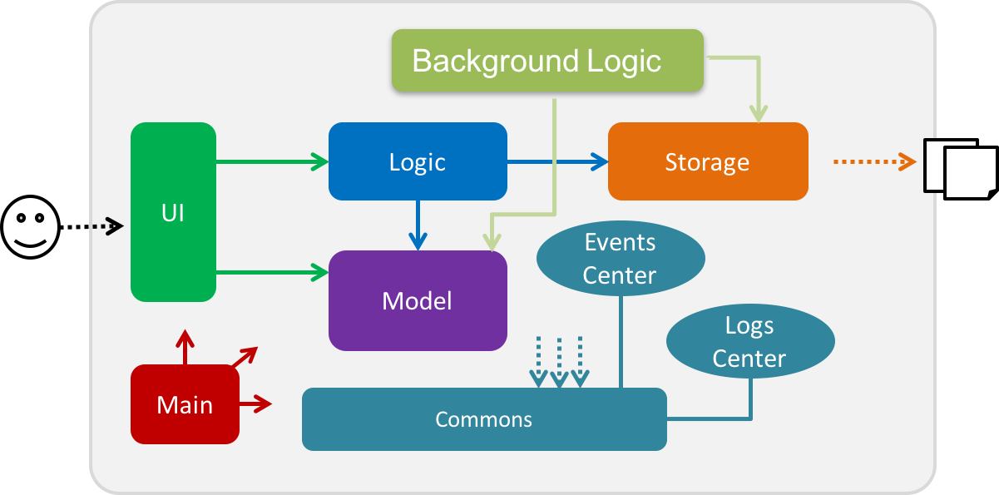
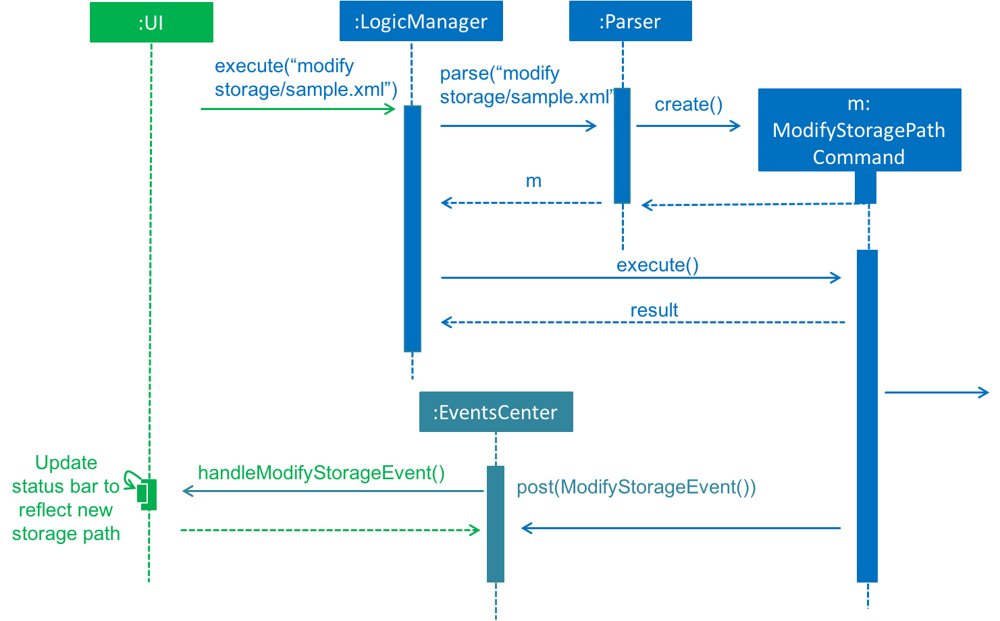
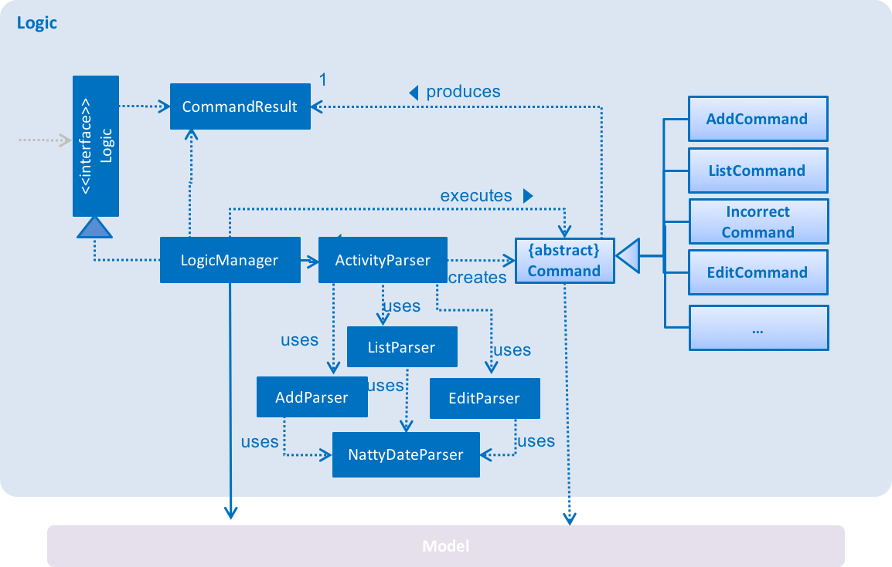
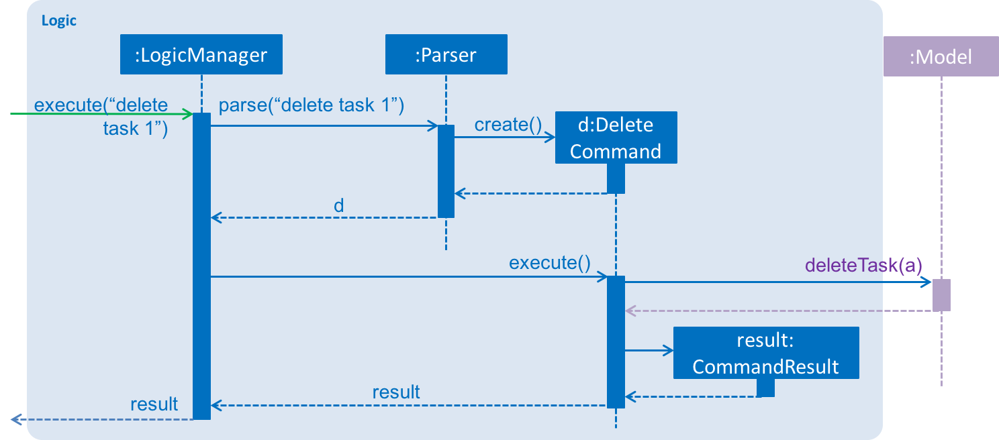
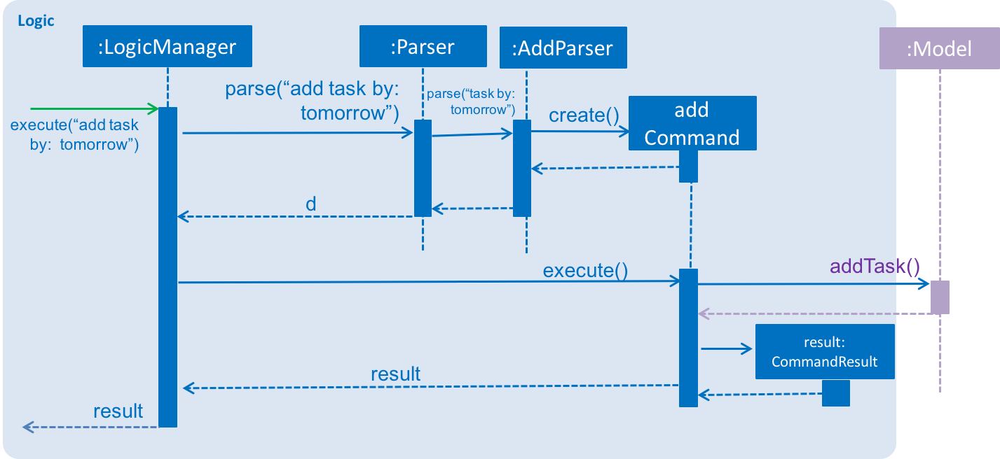
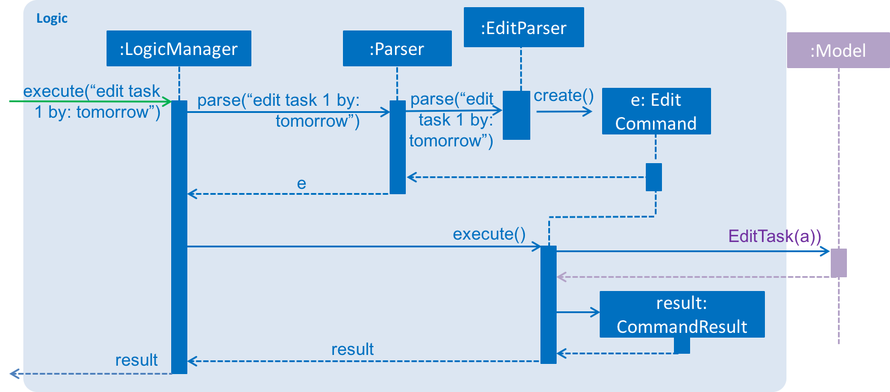
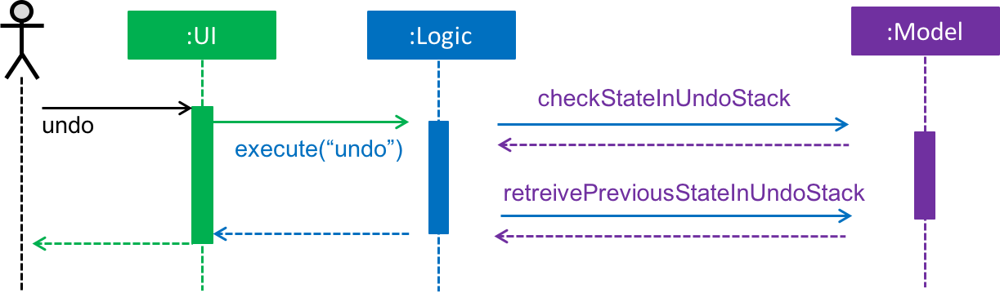
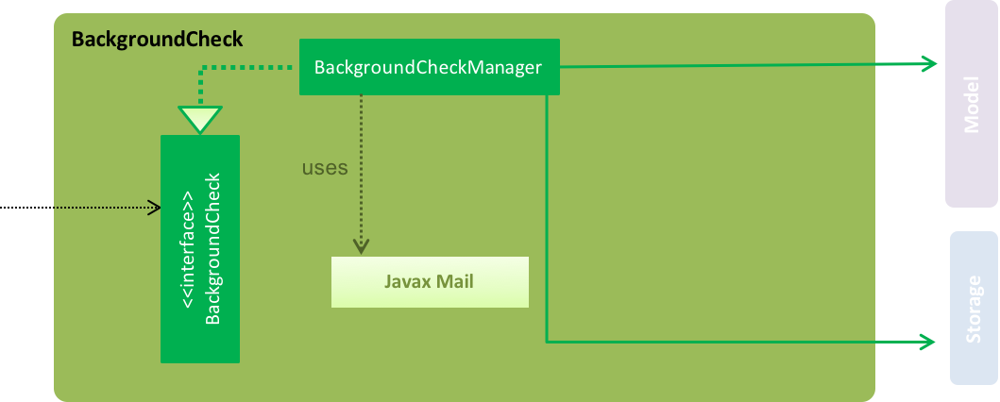

<h1> Menion Developer Guide</h1> 

# Introduction

[//]: # (@@author A0146752B)

Menion is a simple activity manager for everyone to track their activities so they can better manage their schedule. It is a command line interface that minimizes mouse usage and focuses on keyboard commands.

This guide will bring you through the design and implementation of Menion. It's purpose is to help you understand how Menion works and how you can further contribute to its development. The content of this guide is structured from a top-down manner to best help you understand how our application works before going into the minute details. Let's begin!

[//]: # (@@author)

# Table of Contents
* [Setting Up](#setting-up)
* [Design](#design)
* [Implementation](#implementation)
* [Testing](#testing)
* [Dev Ops](#dev-ops)
* [Appendix A: User Stories](#appendix-a-user-stories)
* [Appendix B: Use Cases](#appendix-b-use-cases)
* [Appendix C: Non Functional Requirements](#appendix-c-non-functional-requirements)
* [Appendix D: Glossary](#appendix-d-glossary)
* [Appendix E: Product Survey](#appendix-e-product-survey)

## Setting up

#### Prerequisites

1. JDK `1.8.0_60`  or later 

    > * Having any Java 8 version is not enough. 
    > * This app will not work with earlier versions of Java 8.
2. Eclipse IDE.
3. e(fx)clipse plugin for Eclipse.
4. Buildship Gradle Integration plugin from the Eclipse Marketplace.

#### Importing the project into Eclipse

1. Fork this repository, and clone the fork to your computer.

2. Open Eclipse.

	> * Ensure you have installed the e(fx)clipse and buildship plugins as given in the 		prerequisites above
3. Click `File` > `Import`
4. Click `Gradle` > `Gradle Project` > `Next` > `Next`
5. Click `Browse`, then locate the project's directory.
6. Click `Finish`

  > * If you are asked whether to 'keep' or 'overwrite' config files, choose to 'keep'.
  > * Depending on your connection speed and server load, it can even take up to 30 minutes for the set up to finish.
      (This is because Gradle downloads library files from servers during the project set up process)
  > * If Eclipse auto-changed any settings files during the import process, you can discard those changes.

## Design

[//]: # (@@author A0139277U)

### Architecture

  
> Figure 1: Architecture of the App 

Figure 1 above explains the high-level design of the App.
Given below is a quick overview of each component.

[*Main*]() has only one class called [`MainApp`](../src/main/java/seedu/menion/MainApp.java). 
It interacts with the different components at 2 specific parts of the App life cycle:

* On app launch: Initializes the components in the correct sequence, and connect them up with each other.
* On exit: Shuts down the components and saves the activity manager.

[//]: # (@@author)

[*Commons*](#common-classes) represents a collection of classes used by multiple other components.
Two of those classes play important roles at the architecture level:

* `EventsCentre` : Used by components to communicate with other components using events (i.e. a form of Event Driven design). (Written using [Google's Event Bus library](https://github.com/google/guava/wiki/EventBusExplained))

* `LogsCenter` : Used by many classes to write log messages to the App's log file.

The rest of the App consists five components.

* [*`UI`*](#ui-component) : Facilitates interaction between the user and the app.
* [*`Logic`*](#logic-component) : Executes the command given by the user.
* [*`BackgroundCheck`*]() : Tracks any changes in data when application is running.   
* [*`Model`*](#model-component) : Holds the data of the App in-memory.
* [*`Storage`*](#storage-component) : Reads data from, and writes data to, the hard disk.

Each of the five components:

* Defines its API in an `interface` with the same name as the Component.
* Exposes its functionality using a `{Component Name}Manager` class.

For example, the `Logic` component (see the class diagram given below) defines it's API in the `Logic.java`
interface and exposes its functionality using the `LogicManager.java` class.

 
> Figure 2: Sequence diagram for delete command

Figure 2 above shows how the components interact for the scenario where the user issues the
command `delete task 1`.

> Notice how the `Model` simply raises a `ActivityManagerChangedEvent` when the Activity Manager data is changed,
 instead of asking the `Storage` to save the updates to the hard disk.

 
> Figure 3 : Continuation of delete command from Figure 2

Figure 3 above shows how the `EventsCenter` reacts to that event, which eventually results in the updates
being saved to the hard disk and the status bar of the UI being updated to reflect the 'Last Updated' time.  
> Notice how the event is propagated through the `EventsCenter` to the `Storage` and `UI` without `Model` being coupled to either of them. This is an example of how this Event Driven approach helps us reduce direct coupling between components.

The sections below give more details of each component.

[//]: # (@@author A0139515A)

### UI component

 
> Figure 4: UI component 

API : [`Ui.java`](../src/main/java/seedu/menion/ui/Ui.java)

The UI consists of a `MainWindow` that is made up of parts. 
For example, `CommandBox`, `ResultDisplay`, `ActivityListPanel`, `StatusBarFooter` etc... All these, including the `MainWindow`, inherit from the abstract `UiPart` class and they can be loaded using the `UiPartLoader`.

`ActivityListPanel` consists of three different activities lists whhich are `taskViewList`, `eventViewList` and `floatingTaskViewList`. Activities in each list is displayed `TaskCard`, `EventCard` and `FloatingTaskCard` respectively.

The `UI` component uses the JavaFx UI framework. The layout of these UI parts are defined in matching `.fxml` files that are in the `src/main/resources/view` folder. For example, the layout of the [`MainWindow`](../src/main/java/seedu/menion/ui/MainWindow.java) is specified in [`MainWindow.fxml`](../src/main/resources/view/MainWindow.fxml) 
 `SceneBuilder` is the main tool that is used to create `.fxml` files.

 
> Figure 5: Sequence diagram for modifying storage path 

The `UI` component

* executes user commands using the `Logic` component by passing in strings that are captured by `CommandBox`.
* binds itself to some data in the `Model` so that the UI can auto-update when data in the `Model` change.
* retrieves the three different lists from `Logic` at the start of the session.
* responds to events raised from various parts of the App and updates the UI accordingly. e.g. `ModifyStoragePathCommand` raise an event that leads to update of storage path in the status bar. (refer to figure 5)

[//]: # (@@author)

### Storage component

 
> Figure 6: Storage component 

API : [`Storage.java`](../src/main/java/seedu/menion/storage/Storage.java)

The `Storage` component

* saves `UserPref` objects in json format and feeds it back.
* saves the Activity Manager data in xml format and feeds it back.

[//]: # (@@author A0139164A)

### Logic component

 
> Figure 7: Logic component  

API : [`Logic.java`](../src/main/java/seedu/menion/logic/Logic.java)

 [`Logic`](../src/main/java/seedu/menion/logic/Logic.java) uses the `ActivityParser` class to parse the user's command. Some commands such as the `AddCommand` and the `EditCommand` use additional `Parser` classes to help further parse the arguments. They result in a `Command` object being created and executed by the `LogicManager`. The command execution can affect the `Model` (e.g. adding an Activity) and/or raise events. The result of the command execution is encapsulated as a `CommandResult` object which is passed back to the `Ui`.

[//]: # (@@author A0146752B)

 
> Figure 8: Sequence Diagram of delete commannd 

Figure 8 is the Sequence Diagram for interactions within the `Logic` component for the `execute("delete task 1")`API call.

[//]: # (@@author A0139277U)

 
> Figure 9: Sequence Diagram in Logic of add command 

Figure 9 above shows the additional steps required by the `AddCommand` to parse its arguments. `ActivityParser` class to parse the user's command. The `ActivityParser` uses the `AddParser` class to parse argument for `AddCommand`. After the additional parsing, it creates a `Command` object and continues on in the same steps as the other commands.

[//]: # (@@author A0139164A)
 
> Figure 10: Sequence Diagram in Logic of edit command 

Figure 10 above shows how `EditCommand` requires an additional step in parsing. `ActivityParser` class passes the user's input to the `EditParser` class to parse the command properly. After parsing, it will return a new `Command` object being created and executed by the `LogicManager`. The command execution can affect the `Model` (e.g. editting an Activity) and/or raise events. The result of the command execution is encapsulated as a `CommandResult` object which is passed back to the `Ui`. This is similar to the `AddCommand`.

[//]: # (@@author A139515A)

 
> Figure 11: Sequence Diagram in Logic of undo command 

Figure 11 above shows how `UndoCommand` makes use of the model to retrieve the previous activity manager.
`UndoCommand` and `RedoCommand` make use of two stacks in `Model` which stores different states of `ReadOnlyActivityManager`. When there is a command that causes modification to `ReadOnlyActivityManager`, a copy of the state of `ReadOnlyActivityManager` before the modification will be pushed into the undo stack. Calling `UndoCommand` will cause a pop from the undo stack and the state will be pushed into the redo stack. Similarly, calling `RedoCommand` will cause a pop from redo stack and the state will be pushed back into the undo stack. This allows the application to jump around different states of `ReadOnlyActivityManager`.

[//]: # (@@A0139277U)
### BackgroundCheck Component
 
> Figure 12: BackgroundCheck component 

API: `BackgroundCheck.java`

The `BackgroundCheck` component

* Constantly checks the model for any activities which may have their date passed. 
* Updates the model if any activities has passed and stores the updated information into `Storage`.

[//]: # (@@author)

### Model component

 
> Figure 13: Model component 

*API* : [`Model.java`](../src/main/java/seedu/menion/model/Model.java)

> The model class is not coupled to the other three components.

The `Model` component

* stores a `UserPref` object that represents the user's preferences.
* stores the Activity Manager data.
* exposes a `UnmodifiableObservableList<ReadOnlyActivity>` that can be 'observed' For example, the UI can be bound to this list so that the UI automatically updates when the data in the list change.
 

### Common classes

Classes used by multiple components are in the `seedu.menion.commons` package.

## Implementation

### Logging

We are using `java.util.logging` package for logging. The `LogsCenter` class is used to manage the logging levels
and logging destinations.

Take note of the following: 

* The logging level can be controlled using the `logLevel` setting in the configuration file
  (See [Configuration](#configuration))
* The `Logger` for a class can be obtained using `LogsCenter.getLogger(Class)` which will log messages according to the specified logging level
* Currently log messages are output through: `Console` and to a `.log` file

[//]: # (@@author A0139164A)

*Logging Levels* can be classified as follows: 

* `SEVERE`: It is a critical problem that may cause the termination of the application.
* `WARNING`: It is a problem which may allow the application to continue to run but do so with caution.
* `INFO`: It is a noteworthy action by the App.
* `FINE`: It may not be noteworthy, but may be useful in debugging.

[//]: # (@@author)

### Configuration

Certain properties of the application can be controlled (e.g App name, logging level) through the configuration file 
(default: `config.json`)

## Testing

Tests can be found in the `./src/test/java` folder. There are two available options for tesing.

1. Eclipse
	* To run all tests, right-click on the `src/test/java` folder and choose
  `Run as` > `JUnit Test`
	* To run a subset of tests, right-click on a test package, test class, or a test and choose to run as a JUnit test.

2. Gradle
	* See [UsingGradle.md](UsingGradle.md) for how to run tests using Gradle

Testing is split into two components:

1. *GUI Tests* - These are System Tests that test the entire App by simulating user actions on the GUI. 
   These are in the `guitests` package.
  
2. *Non-GUI Tests* - These are tests not involving the GUI. They include:
   * Unit tests targeting the lowest level methods/classes. 
      e.g. `seedu.menion.commons.UrlUtilTest`
       
   * Integration tests that are checking the integration of multiple code units (those code units are assumed to be working).
      e.g. `seedu.menion.storage.StorageManagerTest`
       
   * Hybrids of unit and integration tests. These tests are checking multiple code units as well as how the are connected together.
      e.g. `seedu.menion.logic.LogicManagerTest`
       
  
>*Headless GUI Testing*:
Thanks to the [TestFX](https://github.com/TestFX/TestFX) library we use,our GUI tests can be run in the headless mode.In the headless mode, GUI tests do not show up on the screen.That means the developer can do other things on the Computer while the tests are running. 
 See [UsingGradle.md](UsingGradle.md#running-tests) to learn how to run tests in headless mode.
 
#### Troubleshooting tests
 *Problem: Tests fail because NullPointException when AssertionError is expected*
 
 * Reason: Assertions are not enabled for JUnit tests. 
   This can happen if you are not using a recent Eclipse version (i.e. Neon or later)
 * Solution: Enable assertions in JUnit tests as described 
   [here](http://stackoverflow.com/questions/2522897/eclipse-junit-ea-vm-option). 
   
Delete run configurations created when you ran tests earlier.
   
## Dev Ops

### Build Automation

See [UsingGradle.md](UsingGradle.md) to learn how to use Gradle for build automation.

### Continuous Integration

We use [Travis CI](https://travis-ci.org/) to perform Continuous Integration on our projects. See [UsingTravis.md](UsingTravis.md) for more details.

### Making a Release

Here are the steps to create a new release:
 
 1. Generate a JAR file [using Gradle](UsingGradle.md#creating-the-jar-file).
 2. Tag the repo with the version number. e.g. `v0.1`
 2. [Create a new release using GitHub](https://help.github.com/articles/creating-releases/) and upload the JAR file your created.
   
### Managing Dependencies

A project often depends on third-party libraries. For example, Activity Manager depends on the [Jackson library](http://wiki.fasterxml.com/JacksonHome) for XML parsing. Managing these dependencies can be automated using Gradle. For example, Gradle can download the dependencies automatically, which is better than these alternatives. 
Remember to include those libraries in the repo (this bloats the repo size). Developers are required to download those libraries manually (this creates extra work for developers). 

## Appendix A : User Stories

Priorities: High (must have) - `* * *`, Medium (nice to have)  - `* *`,  Low (unlikely to have) - `*`

[//]: # (@@author A0146752B)

Priority | As a ... | I want to ... | So that I can...
-------- | :-------- | :--------- | :-----------
`* * *` | new user | see usage instructions | refer to instructions when I forget how to use the App
`* * *` | user | add a new activity | track my activities
`* * *` | user | delete an activity | remove activities that I no longer need
`* * *` | user | edit a command | modify the details of an activity
`* * *` | user | undo a command | revert back to the state before I made a wrong command
`* * *` | user | find an activity by name | locate details of activities without having to go through the entire list
`* * *` | user | have a one-shot approach to add activities | minimize clicking and save time
`* * *` | user | indicate a completion of an activity | keep track of activities which I have completed
`* * *` | user | track completed/uncompleted activities | better manage my schedule
`* * *` | user | modify storage path | store data in my desired location
`* * *` | user | search for my activities using keywords | locate activities quickly
`* *` | user | upload my schedule online and sync them across devices | view my schedules when I am using different devices
<<<<<<< HEAD
`* *` | user | set recurring activities| add repeated activities just once
`* *` | user | sort activities by different datelines | have a clearer view of what needs to be completed first

{More to be added}
=======
`* *` | user | sort activities by different datelines | have a clearer view of what needs to be completed first
>>>>>>> 9fac70e7d6976538d0a389dca9ba026816c3710f

[//]: # (@@author A0139164A)

## Appendix B : Use Cases

(For all use cases below, the **System** is the `Menion` and the **Actor** is the `user`, unless specified otherwise)

#### Use Case : Add Activity
**MSS**

1. User enters add command followed by the details of the Activity.
2. Menion creates the Activity based on the details of the Activity and puts it in the database.
3. Menion displays the Activity added.

Use case ends.

**Extensions**

1a. Details of the Activity do not match format.

> 1a1. Menion prompts user to re-enter Activity. 
> 1a2. User inputs a new task. 
> Repeat 1a1 - 1a2 until user inputs the correct format. 
> Use case resumes at step 2.

[//]: # (@@author A0146752B)

#### Use Case : Delete Activity

**MSS**

1. User enters command followed by the activity type and the indices of the Activities to be deleted.
2. Menion does a search through the database and deletes the Activities.
3. Menion displays the list of Activity left in the database.

Use case ends.

**Extensions**

1a. The indices input by the user is not in the range of indices available.

> 1a1. Menion prompts user to re-input the indices of the Activities. 
> 1a2. User reinputs the indices of the Activities. 
> Repeat 1a1 - 1ab until user inputs valid indices of the Activities. 
> Use case resumes at step 2.

[//]: # (@@author A0139515A)

#### Use Case : Undo

**MSS**

1. User enters undo command.
2. Menion reverts back to the state of the previous command.

Use case ends.

**Extensions**

1a. There is no previous command available to undo.

> 1a1. Menion prompts user to enter another command. 
> 1a2. Use case ends.

[//]: # (@@author A0139164A)

#### Use Case : Edit Activity

**MSS**

1. User enters edit command followed by the name of the Activity to be edited, it's index, the parameter that is to be edited, and the changes to be made.
2. Menion displays the updated information of the Activity.

Use case ends.

**Extensions**

1a. The index of the Activity entered by the user does not exist.

> 1a1. Menion prompts user to re-input index of the Activity. 
> 1a2. User re-inputs the index of Activity. 
> Repeat 1a1 - 1a2 until the user inputs a valid index of Activity. 
> Use case resumes at step 2.

1b. The information entered by the user does not follow the format.

> 1b1. Menion prompts user to re-input edit command of the Activity in the given format. 
> 1b2. User re-inputs edit command of the Activity. 
> Repeat 1b1 - 1b2 until the user inputs a valid format of edit command for the Activity. 
> Use case resumes at step 2.

[//]: # (@@author A0139277U)

#### Use Case : List

**MSS**

1. User enters list command followed by the addition filters of the listing.
2. Menion displays the list of activities according to the filters input by the user.

Use case ends.

**Extensions**

1a. The filter input by the User is not valid.
> 1a1. Menion prints out error message and requests for another input. 
> 1a2.  Repeat step 1a1 until user inputs a valid filter for the list command.

1b. User requests for Menion to list all the Activity.
> 1b1. Menion shows a list of all the Activities in the Menion. 
> 1b2. Resume to step 2 in MSS.

1c. User requests for Menion to list all Activity of a specified date / week / month.
> 1c1. Menion shows a list of all the Activities in the Menion which has a deadline of the specified date. 
> 1c2. Resume to step 3 in MSS.

[//]: # (@@author A0146752B)

#### Use Case: Find

**MSS**

1. User enters find command followed by the keywords of the search.
2. Menion performs the find command.
3. Menion displays the details of the Activities with names/notes containing the keywords.

Use case ends.

**Extensions**

2a. There is no Activity with the keyword stated.
> 2a1. Menion displays '0 activities listed!' message. 
> Use case ends.

[//]: # (@@author A0139515A)

#### Use Case : Modify Storage Path
**MSS**

1. User requests to modify the storage path.
2. Menion prompts user to key in new desired storage path.
3. User types in the new desired storage path.
4. Menion updates the new storage path.

Use case ends.

**Extensions**

2a. The given storage path is invalid.
> 2a1. Menion shows an error message. 
> Use case resumes at step 2.

[//]: # (@@author A0146752B)

## Appendix C : Non Functional Requirements

1. Should work on any [mainstream OS](#mainstream-os) as long as it has Java `1.8.0_60` or higher installed.
2. Should be able to hold up to 1000 Tasks.
3. Should come with automated unit tests and open source code.
4. Should favor DOS style commands over Unix-style commands.
5. Should be able to save activities offline, so that the user can use the application when the user does not have internet access.
6. Should be able to use the application without constantly refering to instructions.
7. Should take less than 1 second for each command.

## Appendix D : Glossary

##### Mainstream OS

> Windows, Linux, Unix, OS-X

## Appendix E : Product Survey

[//]: # (@@author A0139515A)

**1. WunderList**

_Pros_
> * No one shot approach of typing details of activity into a command line.  
> * Able to be used offline.  
> * When online, able to sync across platforms. 
> * Able to sync to calendar which can be exported. 
> * Simple user interface.

_Cons_
> * Commands require both mouse and command line input. 
> * Requires a lot of mouse clicking. 
> * Unable to set time for deadline. 
> * Unable to synchronize schedule without 3rd party calendar app. 

[//]: # (@@author A0139277U)

**2. Fantastical**

_Pros_
> * Has calendar view for all activities. 
> * Has beautiful user interface. 
> * Able to be used offline. 
> * Able to sync across platforms when online.

_Cons_
> * No one shot approach of typing details of activity into a command line. 
> * Requires a lot of mouse clicking.

[//]: # (@@author A0146752B)

**3. Any.do**

_Pros_
> * Has a very simple user interface. 
> * Has list view, time view, or combined view. 
> * Able to sync across platforms when online.

_Cons_
> * No one shot approach of typing details of activity into a command line.

