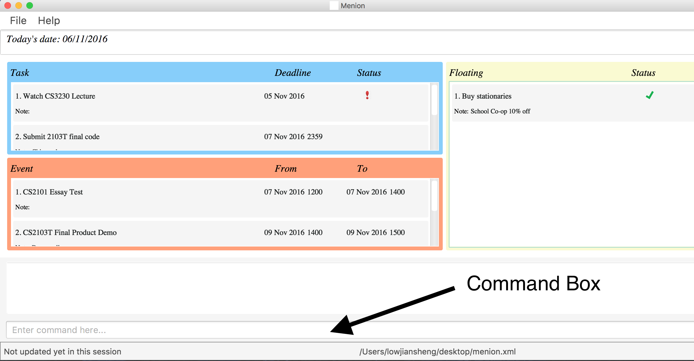
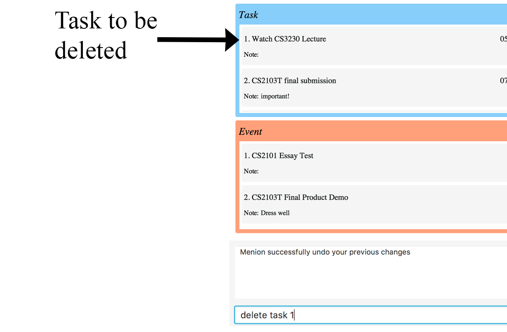

[//]: # (@@author A0146752B)

<h1> Menion User Guide </h1> 

# Table of Contents
* [Introduction](#introduction)
* [Quick Start](#quick-start)
* [Features](#features)
  * [Add Activity](#adding-an-activity)
  * [Delete Activities](#deleting-activities)
  * [List Activities](#list-activities)
  * [Clear Activities](#clearing-all-entries)
  * [Edit Activities](#editing-an-activity)
  * [Complete Activities](#complete-an-activity)
  * [Uncomplete Activities](#uncomplete-an-activity)
  * [Undo Command](#undo)
  * [Redo Command](#redo)
  * [Modify Storage Path](#modifying-the-storage-path)
  * [Help](#viewing-help)
  * [Exit](#exiting-the-program)
* [Saving Data](#saving-the-data)
* [FAQ](#faq)
* [Command Summary](#command-summary)

## Introduction
Ever felt overwhelmed from the multitude of tasks you have to complete and have no idea where to start? Are you looking for an easy to work with application to help you track all your activities? Well look no further! Your very own Menion is here to assist you!

Menion is your personal assistant that tracks all your activities and displays them in a simple to read display. It saves you the hassle of remembering what needs to be done and is able to help you prioritise your tasks.

Unlike other complicated task managers, Menion is simple and intuitive. It relies completely on the keyboard and only requires a single line of command. This removes the inconvenience of clicking and navigating through multiple interfaces for you. It also has a flexible command interface, and is able to accept variations of the same command, removing the need to memorise a certain format for every command. 

Let's get started!
## Quick Start

1. Ensure you have Java version `1.8.0_60` or later installed in your Computer. 
   > Having any Java 8 version is not enough.  
   This app will not work with earlier versions of Java 8.
   
2. Download Menion: You can download Menion.jar from the latest release here: 
   [Menion.jar](https://github.com/CS2103AUG2016-W14-C2/main/releases/download/V0.5/Menion.jar)
3. Copy the file to the folder you want to use as the home folder for  Menion.
4. Double-click the file to start the app. The GUI should appear in a few seconds.   
 
>Figure 1 : The user interface presented after start up

5. Type the command in the command box as shown in Figure 1 and press <kbd>Enter</kbd> to execute it.  
   e.g. typing `help` and pressing <kbd>Enter</kbd> will open the help window. 
6. Some example commands you can try:

	* `add Assignment 2 by: TASK_DEADLINE_DATE TASK_DEADLINE_TIME n: NOTES`
   * `list all`: lists all activities
   * `delete event 3` : deletes the 3rd event shown in the current list
   * `exit` : exits the app
7. Refer to the [Features](#features) section below for details of each command. 

[//]: # (@@author)

## Features

> **Command Format** 
> Words in `UPPER_CASE` are the parameters. 
> Items with `...` after them can have multiple instances. 
> The order of parameters is fixed.

> **Important** (change to diagram)   
> Menion supports 3 types of activities. Tasks, Events and Floating Tasks. 
> <li style="padding-top:1px">Task has a deadline.
> <li>Event has a starting date/time and an ending date/time.
> <li> Floating Task does not have any dates attached to it.

[//]: # (@@author A0139277U)

#### Adding an activity 
Adds an activity to Menion. 

Formats :  
`add TASK_NAME by: TASK_DEADLINE_DATE TASK_DEADLINE_TIME n:NOTES...`  
`add EVENT_NAME from: EVENT_START_DATE EVENT_START_TIME to: EVENT_END_DATE EVENT_END_TIME n:NOTES...` 
`add FLOATING_TASK_NAME n:NOTES...`  
> Task and event are differentiated by the input of time tag. Each activity can have any number of notes (can be left blank).
  
> DATE and TIME Formats
> 
> - Formal dates : mm-dd-yyyy hhmm, mm/dd/yyyy hhmm
> - Informal dates : tomorrow, next monday 12pm
> 

Examples:  
`add Dinner With Family from: tomorrow 1900 to: tomorrow 2000 n: bring flowers` 
`add Buy lunch n: hawker food` 
`add CS2103T final submission by: tomorrow n: important!`

 
>Figure 2 : Screenshot of adding an activity into Menion.

[//]: # (@@author A0146752B)

#### Deleting activities
Deletes 1 or more activities from Menion at the specified `INDEX`/`INDICES`. 
Format: 
`delete ACTIVITY_TYPE INDEX...`

>The `Index` refers to the index number shown beside the activity. 
>The index must be a positive integer 1,2,3,... 
>There are 3 `ACTIVITY_TYPE`: event, task, floating 
>In each delete instance, you can only delete activites from the same activity type.

Examples: 
`delete event 2 3 6` 
`delete floating 2 1` 
`delete task 1` 

 
>Figure 3 : The index of activity to be deleted.

[//]: # (@@author A0139277U)

#### List Activities
Shows a list of activities in Menion for specified parameters such as date, month, completion status and keywords.

Formats:  
`list all`  
`list MONTH`  
`list DATE`  
`list COMPLETION_STATUS`  

Examples: 
`list all` 
`list january` 
`list 08-18-2016` 
`list completed` 

> List parameters are case-insensitive.  
> `list completed` will fit `list CoMpleted`. 
> Listing of dates has to be in the format of dd-mm-yyyy.

[//]: # (@@author A0146752B)

#### Find Activities
Shows a list of activities in Menion for specified keywords in their activity name and notes.

Format:  
`find KEYWORDS` 

Examples: 
`find cs2103T` 
`find laundry` 

>Find parameters are case-insensitive. Cs2103T will match cs2103t.

[//]: # (@@author A0139164A)

#### Clearing all entries
Clear all entries from Menion. 

Format : `clear`

#### Editing an activity
Edits an activity from Menion at the specified `INDEX`.

Format : `edit ACTIVITY_TYPE INDEX PARAMETERS`
> The index refers to the index number shown beside the activity.  
> The parameters to be edited should be the same parameters as the existing activity type. 
> The index must be a positive integer 1,2,3, ...

Parameters : 

`name: ACTIVITY_NAME`  
`by: DEADLINE` 
`n: NOTES` 
`from: START_DATE START_TIME` 
`to: END_DATE END_TIME` 

Examples :

`edit event 3 from: tomorrow 1900 to: the day after tomorrow 9pm` 
`edit floating 1 name: Hello World` 
`edit task 2 by: sunday n: Yay extension!` 
 

#### Complete an activity
Marks an activity as completed.

Format : `complete ACTIVITY_TYPE ACTIVITY_INDEX`

Examples : 

`complete event 3` 
`complete task 3`

#### Uncomplete an activity
Marks an activity as uncompleted.

Format : `uncomplete ACTIVITY_TYPE ACTIVITY_INDEX`

Examples : 

`uncomplete event 3` 
`uncomplete task 3`

#### Set reminder for tasks
Enables menion to send notifications to the specified `EMAIL_ADDRESS` to remind users of uncompleted overdue tasks.

Format : `remind EMAIL_ADDRESS`

Example :
`remind jondoe@gmail.com`

#### Unset reminder for tasks
Disables menion from sending notifications to previously specified `EMAIL_ADDRESS` to remind users of uncompleted overdue tasks.

Format : `unremind`

[//]: # (@@author A0139515A)

#### Undo
Undo the most recent command. 
>Only applicable for add, delete, edit, complete, uncomplete and clear commands

Format : `undo`

Undo modify storage path command. 

Format : `undo modify`

#### Redo
Redo the most recent command.
>Only applicable for add, delete, edit, complete, uncomplete and clear commands

Format : `redo`

Redo modify storage path command. 

Format : `redo modify`

#### Modifying the storage path
Modifies the storage path that stores all the data. 

Format : `modify STORAGE_LOCATION`
> Enter `modify default` to revert to the original file storage

Example :

`modify Dropbox/MyStorage/menion.xml`

[//]: # (@@author A0146752B)

#### Viewing help
Shows a list of available commands and how to use them. 

Format : `help`

#### Exiting the program
Exits the program. 

Format : `exit`

#### Saving the data
Menion data is saved in the hard disk automatically after any command that changes the data.
There is no need to save manually. 

[//]: # (@@author)

## FAQ

**Q** : How do I transfer my data to another computer? 
**A** : Install Menion in the other computer and overwrite the empty data file it creates with 
       the file that contains the data of your previous Menion folder.
       
[//]: # (@@author A0139515A)
             
## Command Summary

Command | Format  
-------- | :-------- 
Add | `add NAME n:NOTES...` `add NAME by: DEADLINE_DATE DEADLINE_TIME n:NOTES...` `add NAME from: START_DATE START_TIME to: END_DATE END_TIME n:NOTES...`
Clear | `clear`
Complete | `complete ACTIVITY_TYPE INDEX`
Delete | `delete ACTIVITY_TYPE INDEX`
Edit | `edit ACTIVITY_TYPE ACTIVITY_INDEX PARAMETER_TO_CHANGE PARAMETER_CHANGES`
Exit | `exit`
Find | `find KEYWORD`
Help | `help`
List | `list all`   `list DATE`   `list MONTH`   `list KEYWORDS`
Modify Storage Path | `modify STORAGE_LOCATION`   `modify default`
Set Reminder | `remind EMAIL_ADDRESS`
Redo | `redo`   `redo modify`
Uncomplete | `uncomplete ACTIVITY_TYPE INDEX`
Undo| `undo`   `undo modify`
Unset Reminder | `unremind`

[//]: # (@@author A0139164A)

## GLOSSARY

Word | Meaning  
-------- | :-------- 
GUI | Graphic User Interface.   The interface presented to users to interact with Menion.
Storage Path | This is the directory where your data will be saved.

